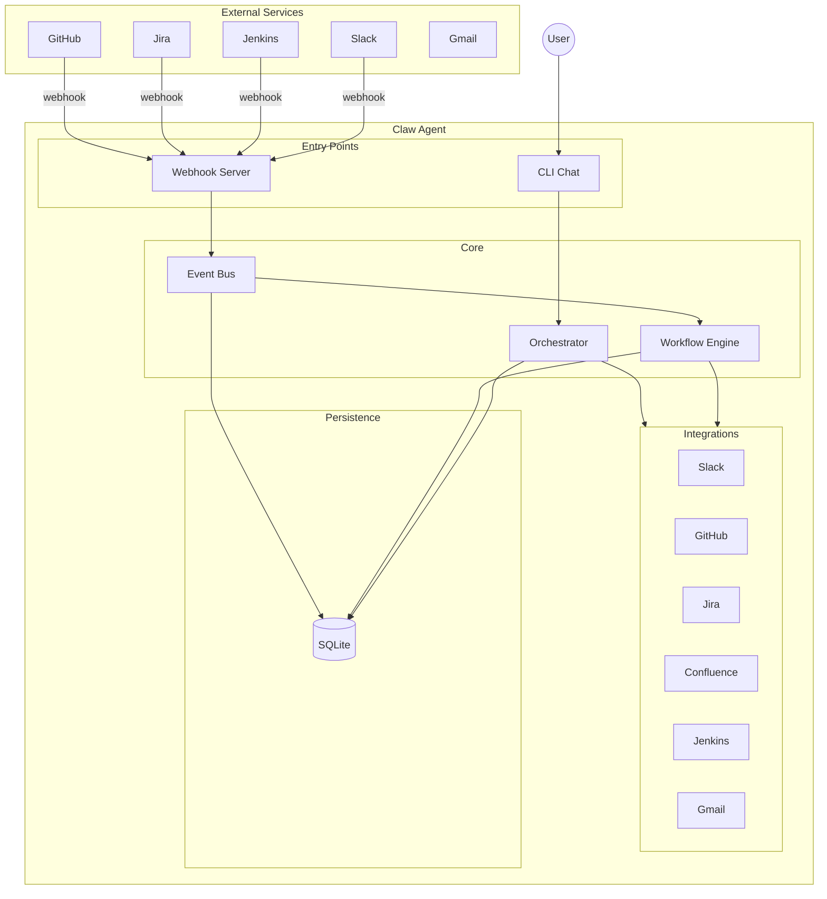
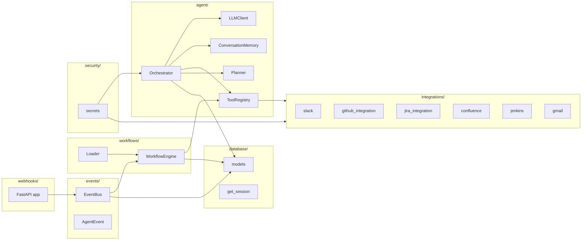
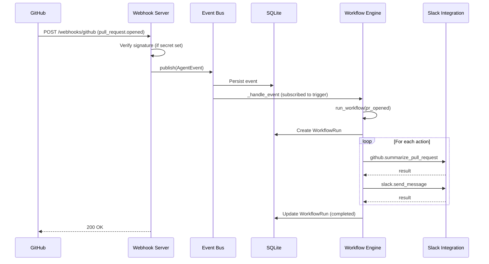
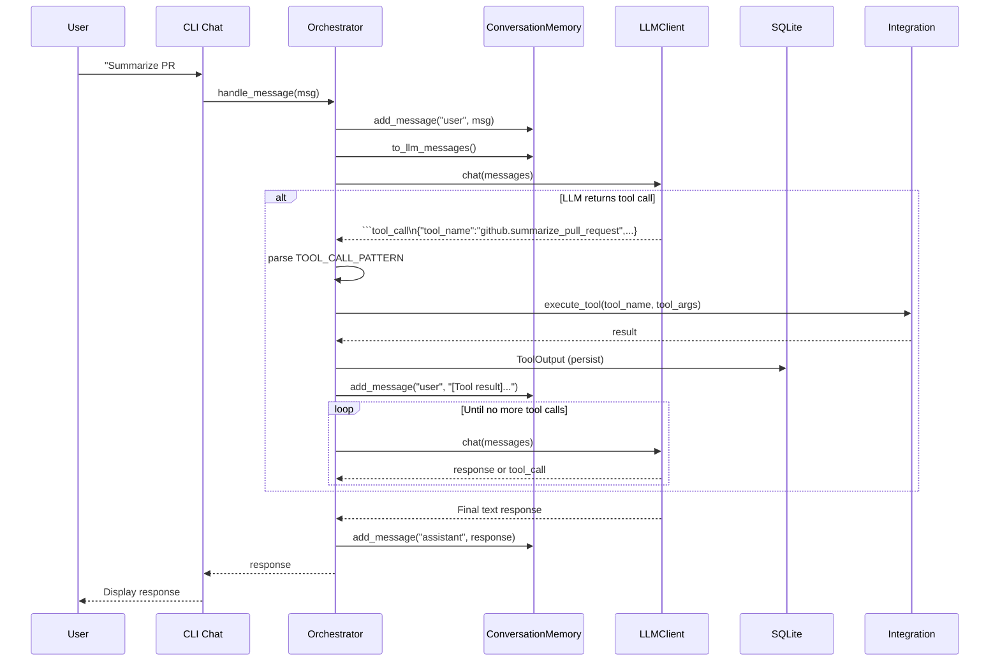
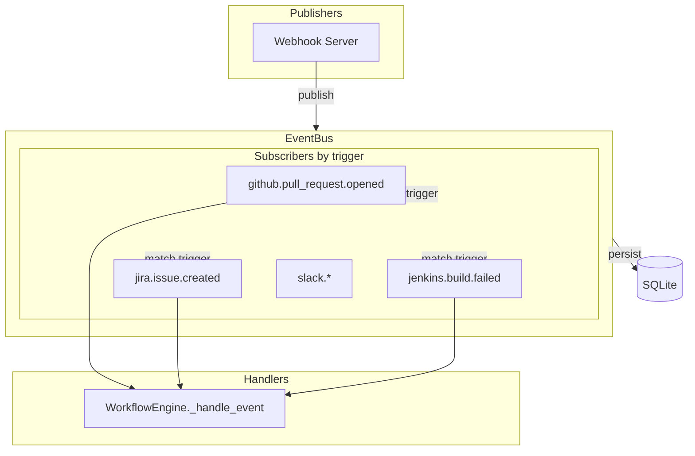
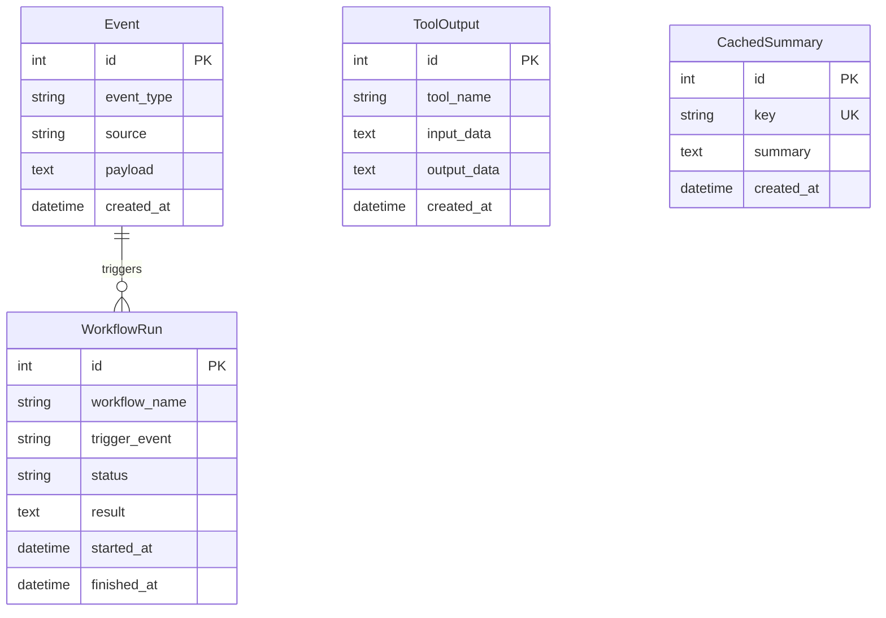

# Claw Agent — Architecture Diagrams

This document describes the architecture and data flows using Mermaid diagrams. Render in GitHub, VS Code (with Mermaid extension), or [mermaid.live](https://mermaid.live).

---

## 1. System Overview

---

## 2. Component Diagram

---

## 3. Webhook → Workflow Flow

---

## 4. Chat Flow (Orchestrator)

---

## 5. Event Bus (Pub/Sub)

---

## 6. Data Model

---

## 7. Supported Event Types

| Source   | Example triggers                          |
|----------|-------------------------------------------|
| GitHub   | `github.pull_request.opened`, `github.issues.opened` |
| Jira     | `jira.issue.created`, `jira.issue.updated` |
| Jenkins  | `jenkins.build.failed`, `jenkins.build.completed` |
| Slack    | `slack.message.received`, `slack.command.received` |

Workflows subscribe to these triggers via `workflows/*.yaml` `trigger` fields.
